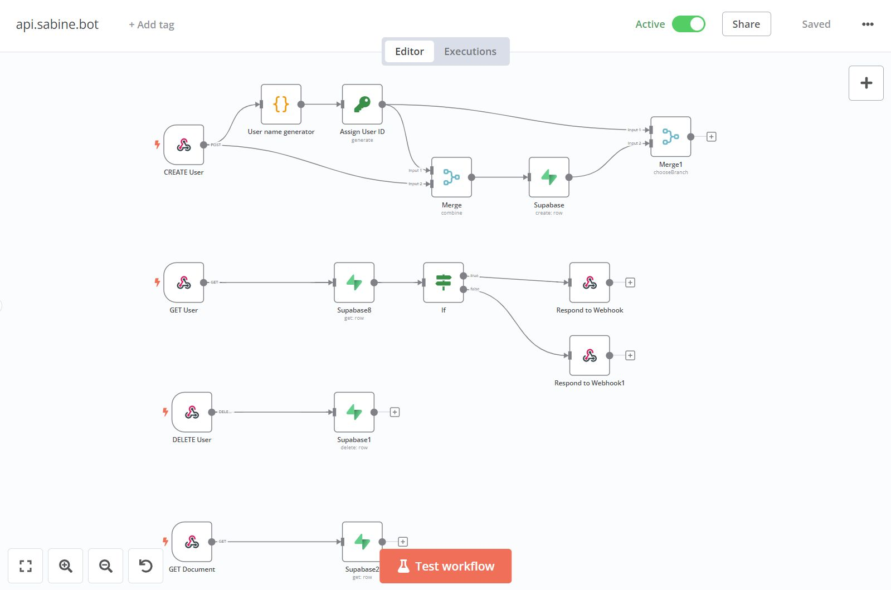
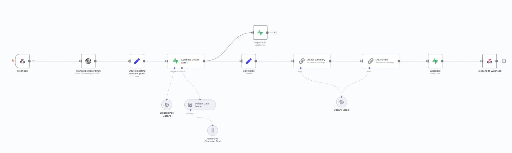
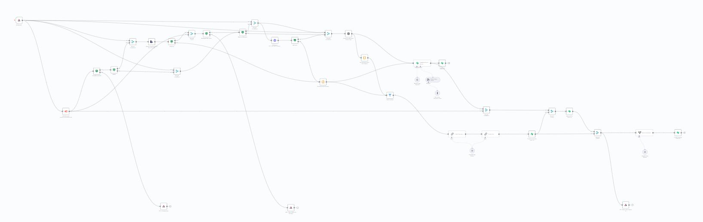

# sabine-backend
low-code backend for sabine.bot, your first personal assistant!

## Overview
This repo keeps version control the json files used to create the low-code backend of [sabine.bot](https://sabine-web.vercel.app).

The automation tool used is [n8n](https://n8n.io/) which offers an awesome integration for [langchain](https://www.langchain.com/) and [supabase](https://supabase.com/).

The live version is self-hosted on a Linux VM on [contabo](https://contabo.com/).

## Screenshot

Some API endpoints implemented with n8n 🍨

The audio processing flow 🤔

The Document processing flow 😱